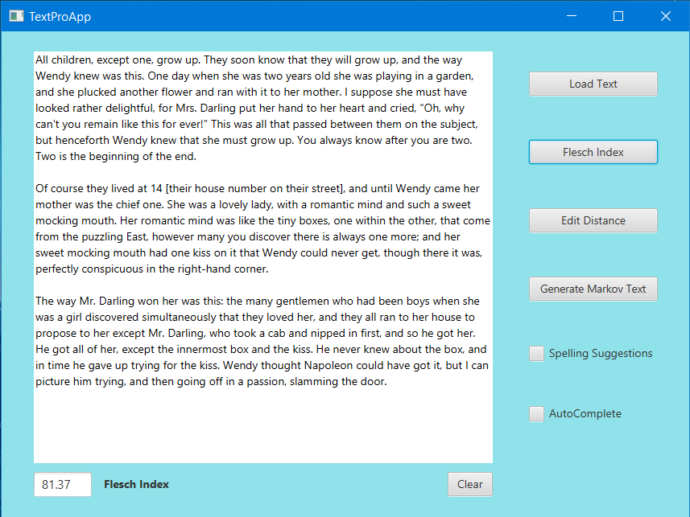
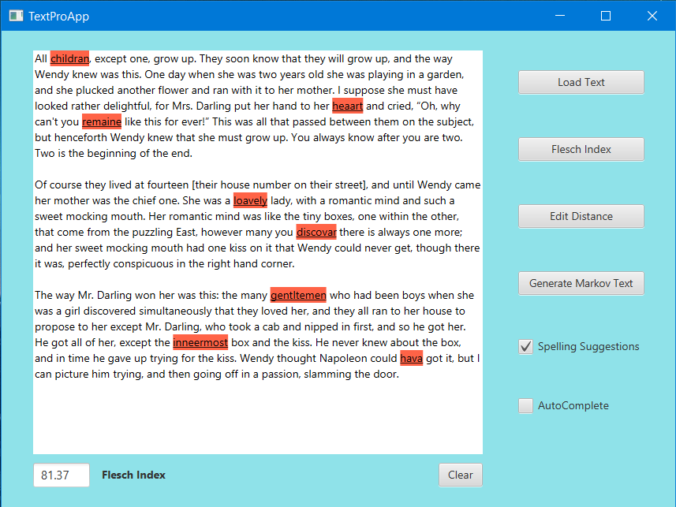
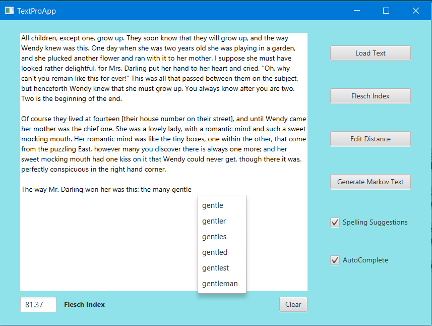
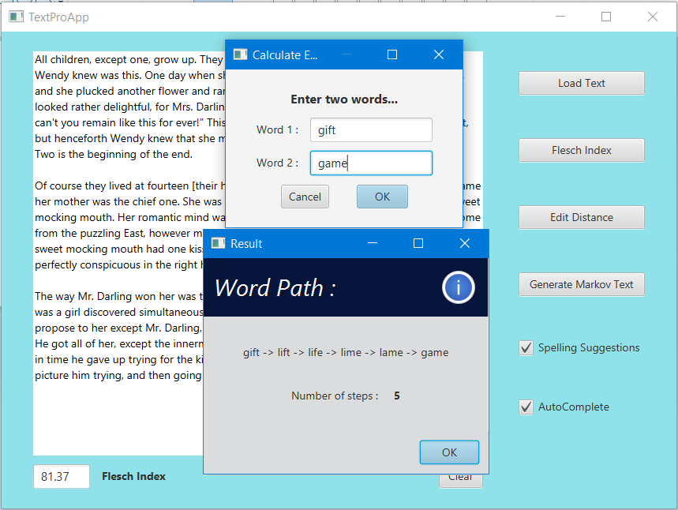
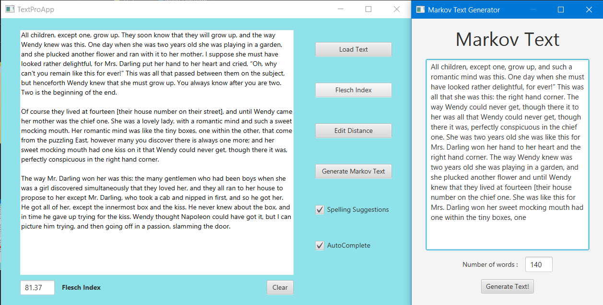

## Coursera - Data Structures and Performance By University of California, San Diego 

#### Instructors: Mia Minnes, Leo Porter and Christine Alvarado

**Course Link -** https://www.coursera.org/learn/data-structures-optimizing-performance

**Certificate Credentials -** https://www.coursera.org/account/accomplishments/certificate/TFZEC27Y59ZX

## Course Description

This is a beginner/intermediate Java course. The main goal is to learn about different Data Structures And Algorithms . We will also learn to process real and large data sets, make programs more efficient, measure effiency of applications and analyse it . And this course is project-based, so by the end of this course we will have completed a cool project.

## Course Modules 

1. Introduction to the Course.
2. Working with Strings.
3. Efficiency Analysis and Benchmarking.
4. Interfaces, Linked Lists vs. Arrays, and Correctness.
5. Trees! (including Binary Search Trees and Tries)
6. Hash Maps and Edit Distance.

## Tasks Completed

1. Learned about String Data Structure and different methods related to it.
2. Learned about Effieciency Analysis and used Benchmarking to compare two data structures.
3. Learned about Interface, Linked List and Arrays and various ways to implement them.
4. Learned and implemented Binary Search Tree, Tries And Hash Maps data structure.
5. Implemented different data structures learned throughout the course to make a Word Processing Application with Word Auto-Correction and Suggestions.
6. Implemented additional features in word processing applicatons like Flesch Index and Markov Text Generator using learned data structures.

## Project Screenshots

   

  

